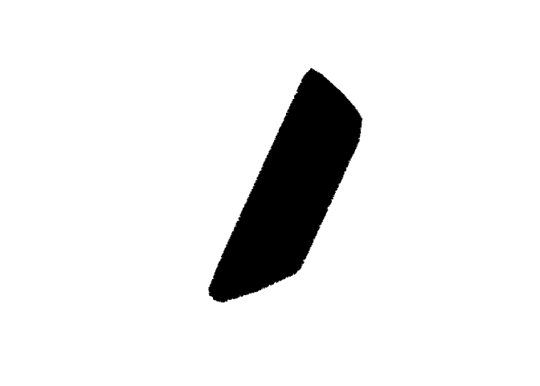

WiRE Lab–Spatial R
================
Clayton Lamb
10 November, 2020

## Load packages and bear data

``` r
library(hrbrthemes)
library(tidyverse)
library(here)
library(lubridate)
library(raster)
library(sf)
library(mapview)
library(adehabitatHR)
library(MuMIn)
library(ggeffects)

##read in bear CSV
bears <- read.csv(here::here("data","bears.csv"))

##get dates in order
bears <- bears%>%
  mutate(DateTime=ymd_hms(DateTime,
                          tz="America/Edmonton")
         ) 

##check it out
head(bears)

bears%>%
  group_by(Name)%>%
  summarise(n=n(),
            start=min(DateTime),
            end=max(DateTime),
            duration=end-start)

##make spatial
bears.spat <-bears%>%
  st_as_sf(coords=c("Longitude","Latitude"),
           crs=4326)

##plot
plot(bears.spat["Name"])
```

<!-- -->

``` r
##map
#mapview(bears.spat["Name"],map.types="Esri.WorldImagery")
```

## Load landscape data

``` r
#first import all files in a single folder as a list 
rastlist <- list.files(path = here::here("data"), pattern='.tif$', all.files=TRUE, full.names=TRUE)

#stack 'em
stack<- stack(rastlist)

#plot
plot(stack)
```

<!-- -->

``` r
##overlay with bear data, important
##remember-- spatial data are just plots with an X and Y (and confusing AF projections...if only the world were truly flat)
plot(stack[[2]])
plot(bears.spat%>%as("Spatial"),add=TRUE)
```

<!-- -->

## Extract landscape data to bear data

``` r
bears.spat.data <- raster::extract(stack, as(bears.spat, "Spatial"), sp=TRUE)%>%st_as_sf()

head(bears.spat.data )
```

    ## Simple feature collection with 6 features and 6 fields
    ## geometry type:  POINT
    ## dimension:      XY
    ## bbox:           xmin: -115.0147 ymin: 49.53903 xmax: -115.0064 ymax: 49.53988
    ## epsg (SRID):    4326
    ## proj4string:    +proj=longlat +datum=WGS84 +no_defs
    ##              DateTime    Name       cc  deltaNDVI hum_density roaddist                   geometry
    ## 1 2019-05-09 14:00:51 Bubbles 39.99400 0.06986283    4.680254 115.4744  POINT (-115.0147 49.5394)
    ## 2 2019-05-09 16:01:24 Bubbles 39.99400 0.06986283    4.680254 115.4744 POINT (-115.0142 49.53903)
    ## 3 2019-05-09 18:00:41 Bubbles 39.99400 0.06986283    4.680254 115.4744 POINT (-115.0141 49.53903)
    ## 4 2019-05-09 20:00:30 Bubbles 39.99400 0.06986283    4.680254 115.4744 POINT (-115.0144 49.53945)
    ## 5 2019-05-09 22:00:40 Bubbles 39.99400 0.06986283    4.680254 115.4744  POINT (-115.013 49.53917)
    ## 6 2019-05-10 00:00:49 Bubbles 37.10379 0.10271567    1.445403 166.3968 POINT (-115.0064 49.53988)

``` r
#mapview(bears.spat.data["roaddist"],map.types="Esri.WorldImagery")
```

## Explore data

``` r
bears.spat.data%>%
  tibble%>%
  dplyr::select(-geometry)%>%
  pivot_longer(cc:roaddist)%>%
  mutate(Date_yearless=ymd(paste("2020", month(DateTime), day(DateTime),sep="-")))%>%
  ggplot(aes(x=Date_yearless,y=value, color=Name))+
  geom_point()+
  facet_wrap(vars(name),scales="free_y")+
  theme_ipsum()+
    theme(axis.title.x = element_text(size=15),
        axis.title.y = element_text(size=15),
        axis.text = element_text(size=10),
        legend.text = element_text(size=13),
        legend.title=element_text(size=15))
```

<!-- -->

``` r
bears.spat.data%>%
  tibble%>%
  dplyr::select(-geometry)%>%
  pivot_longer(cc:roaddist)%>%
  mutate(month=month(DateTime))%>%
  group_by(Name,month,name)%>%
  summarise(value=mean(value))%>%
  ggplot(aes(x=month,y=value, color=Name))+
  geom_point()+
  facet_wrap(vars(name),scales="free_y")+
  geom_smooth()+
    theme_ipsum()+
    theme(axis.title.x = element_text(size=15),
        axis.title.y = element_text(size=15),
        axis.text = element_text(size=10),
        legend.text = element_text(size=13),
        legend.title=element_text(size=15))
```

<!-- -->

## Add in some availables

``` r
mcp <- mcp(bears.spat%>%as("Spatial")%>%as("SpatialPoints"), percent=95)

plot(mcp)
plot(bears.spat%>%as("Spatial"),add=TRUE)
```

<!-- -->

``` r
##sample from within this mcp
avail <- st_sample(mcp%>%st_as_sf(),size=10000)

plot(mcp)
plot(avail%>%as("Spatial"),add=TRUE) ##looks like furry animal
```

<!-- -->

``` r
##extract landscape data to availables
avail.data <- raster::extract(stack, as(avail, "Spatial"), sp=TRUE)%>%st_as_sf()
```

## Get used-available data together

``` r
bears.spat.data <-bears.spat.data%>%
  tibble%>%
  dplyr::select(-geometry)%>%
  mutate(used=1,
         month=month(DateTime))

data <-bears.spat.data%>%
  rbind(
    avail.data%>%
      tibble%>%
      mutate(used=0,
             DateTime=NA,
             Name=NA,
             month=runif(10000,5,10)%>%round(0))%>%
            dplyr::select(colnames(bears.spat.data))
  )%>%
  drop_na(cc:roaddist)
  


data%>%
  pivot_longer(cc:roaddist)%>%
  group_by(month,name,used)%>%
  summarise(value=mean(value))%>%
  ggplot(aes(x=month,y=value, color=as.factor(used)))+
  geom_point()+
  facet_wrap(vars(name),scales="free_y")+
  geom_smooth()+
    theme_ipsum()+
    theme(axis.title.x = element_text(size=15),
        axis.title.y = element_text(size=15),
        axis.text = element_text(size=10),
        legend.text = element_text(size=13),
        legend.title=element_text(size=15))
```

<!-- -->

## Model

``` r
null <- glm(used~1, data=data,family="binomial")
m1 <-glm(used~cc+deltaNDVI, data=data,family="binomial")
m2 <-glm(used~hum_density+roaddist, data=data,family="binomial")
m3 <-glm(used~cc+deltaNDVI+hum_density+roaddist, data=data,family="binomial")
m4 <-glm(used~cc+deltaNDVI+hum_density*month+roaddist*month, data=data%>%mutate(month=as.factor(month)),family="binomial")

model.sel(null,m1,m2,m3,m4)
```

    ## Model selection table 
    ##         (Int)      cc    dND   hum_dns        rdd mnt hum_dns:mnt mnt:rdd df    logLik    AICc   delta weight
    ## m4   -0.63740 0.02179  8.324 -0.002750 -0.0008274   +           +       + 20 -10039.58 20119.2    0.00      1
    ## m3   -1.31900 0.01983  8.367 -0.003502 -0.0005338                          5 -10552.02 21114.0  994.83      0
    ## m1   -1.91000 0.02260 11.330                                               3 -10727.16 21460.3 1341.10      0
    ## m2   -0.01816                -0.004995 -0.0007276                          3 -10837.16 21680.3 1561.10      0
    ## null -0.39880                                                              1 -11243.93 22489.9 2370.66      0
    ## Models ranked by AICc(x)

## Plot results

``` r
plot(ggpredict(m4, terms = c("deltaNDVI")))
```

<!-- -->

``` r
plot(ggpredict(m4, terms = c("month","hum_density[50]")))
```

<!-- -->

``` r
plot(ggpredict(m4, terms = c("roaddist","month[5,7,10]")))
```

<!-- -->

## Map results

``` r
month <- stack[[1]]
values(month)=7
month<- ratify(month)
names(month)="month"

map.summer <- predict(stack%>%
  addLayer(month),m4, type="response")
plot(map.summer)
```

<!-- -->

``` r
values(month)=10
map.fall <-predict(stack%>%
  addLayer(month),m4, type="response")
plot(map.fall)
```

<!-- -->
